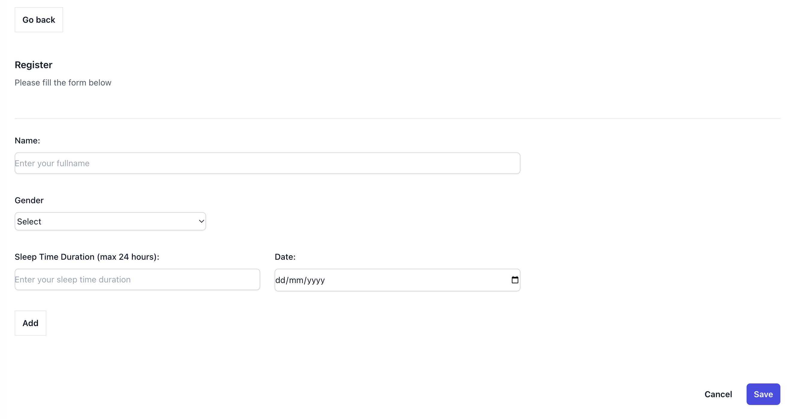

# SLEEP MONITOR APP

### About the Sleep Monitor App
The sleep monitor app is built using [React]('https://react.dev/learn/installation') and [TypeScript]('https://www.typescriptlang.org/).
The styling of the app uses [TailWindCss](https://tailwindcss.com/)
Unit test was written for this app using [jest](https://jestjs.io/) and all 14 test cases passed.
The charts for display uses [Apache Echarts](https://echarts.apache.org/handbook/en/get-started/) and the app interfaced with Echarts using this [npm package](https://www.npmjs.com/package/echarts)


The app has 4 main pages
- Home Page
This contains the links to register and also preview any registration
- Register Page
This page is where the actual filling of the form begins with name, gender, date , and sleep time duration in hours
- Preview Page
This displays the data saved for every registration as well as a chart 
- No Page
This is a 404 page

The app uses localstorage to improvise for a real database;

### Time Estimate
- Estimated Time to completion = 10 Hours

### To Clone / Download the app
-  Download the app by visiting [Github maxteebabs](https://github.com/maxteebabs/sleep-monitor/tree/master)
```sh
git clone https://github.com/maxteebabs/sleep-monitor.git
```

### To Start the application
- First Install Dependencies
```sh
npm install
```
- Start the app
```sh
npm start
```

### To run test
```sh
npm test
```

### Learn More

You can learn more in the [Create React App documentation](https://facebook.github.io/create-react-app/docs/getting-started).

To learn React, check out the [React documentation](https://reactjs.org/).


### Screenshots





